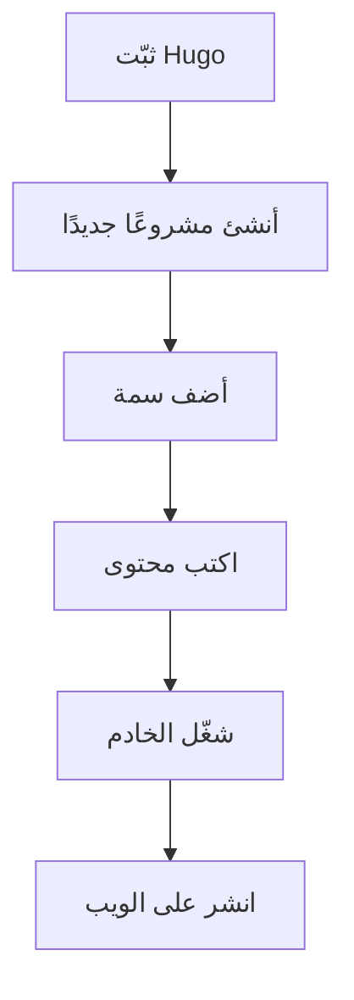

**مرحبًا بكم في وثائق Hugo باللغة الإندونيسية!**

  
_Hugo - إطار عمل سريع وعصري لبناء المواقع._

## **📌 مقدمة**

Hugo هو مولد مواقع ثابتة (SSG) مبني على لغة Go، سريع، مرن، وسهل الاستخدام. ستساعدك هذه الوثائق على فهم كيفية استخدام Hugo باللغة الإندونيسية.

إذا كنت جديدًا على Hugo، فلنبدأ بشرح موجز.

---

## **🚀 لماذا تختار Hugo؟**

يقدم Hugo العديد من المزايا، مثل:

- ⚡ **السرعة** – مبنية بلغة Go، يولد Hugo المواقع في أجزاء من الثانية.
- 📂 **سهولة الاستخدام** – تركيب بسيط مع Markdown وقوالب قوية.
- 🛠 **المرونة** – مناسب للمدونات، المحافظ، الوثائق، وغير ذلك الكثير.
- 🌍 **مجتمع نشط** – دعم واسع من المطورين حول العالم.

---

## **📖 أساسيات Hugo**

### **1. تثبيت Hugo**

لبدء استخدام Hugo، تحتاج إلى تثبيته أولاً. إليك الطريقة:

#### **في Windows (عبر Chocolatey):**

```powershell
choco install hugo -confirm
```

#### **في macOS (عبر Homebrew):**

```bash
brew install hugo
```

#### **في Linux (Debian/Ubuntu):**

```bash
sudo apt-get install hugo
```

### **2. إنشاء مشروع جديد**

بعد التثبيت، أنشئ موقعًا جديدًا بالأمر:

```bash
hugo new site اسم-المشروع
```

### **3. تشغيل خادم محلي**

لمعاينة النتائج في الوقت الفعلي، شغّل:

```bash
hugo server -D
```

افتح `http://localhost:1313` في متصفحك.

---

## **🔧 الميزات الرئيسية لـ Hugo**

### **📝 المحتوى باستخدام Markdown**

يستخدم Hugo Markdown لإنشاء المحتوى. مثال:

```markdown
---
title: "المقال الأول"
date: 2025-07-25
---

# مرحبًا بالعالم!

هذه هي مقالتي الأولى باستخدام Hugo.
```

### **🎨 القوالب والسمات**

يدعم Hugo سمات متنوعة. ثبّت سمة باستخدام:

```bash
git clone https://github.com/صاحب-السمة/اسم-السمة.git themes/اسم-السمة
```

ثم اضبط في `config.toml`:

```toml
theme = "اسم-السمة"
```

### **⚙️ تكوين الموقع**

ملف `config.toml` هو مركز إعدادات Hugo. مثال:

```toml
baseURL = "https://example.com/"
languageCode = "id-id"
title = "موقعي على Hugo"
```

---

## **📌 نصائح وحيل**

✅ **استخدم Shortcodes** – يسهل إدراج العناصر الديناميكية.  
✅ **تحسين الصور** – يد Hugo معالجة الصور مدمجة.  
✅ **نشر بسهولة** – يمكن استضافته على Netlify أو Vercel أو GitHub Pages.

---

## **❓ الأسئلة الشائعة (FAQ)**

### **❔ هل Hugo مناسب للمبتدئين؟**

نعم! لدى Hugo منحنى تعلم سلس بفضل وثائق شاملة.

### **❔ هل يمكن استخدام Hugo للتجارة الإلكترونية؟**

Hugo هو مولد مواقع ثابتة، لذا فهو غير مناسب للتجارة الإلكترونية الديناميكية. لكن يمكن دمجه مع حلول مثل Snipcart.

### **❔ كيف أضيف تعليقات؟**

استخدم خدمات مثل Disqus أو Utterances (المعتمدة على GitHub).

---

## **📚 مراجع إضافية**

- [الوثائق الرسمية لـ Hugo](https://gohugo.io/documentation/)
- [منتدى مجتمع Hugo](https://discourse.gohugo.io/)
- [مجموعة سمات Hugo](https://themes.gohugo.io/)

---

**🎉 تهانينا! أنت جاهز للبدء مع Hugo.**  
إذا كان لديك أي أسئلة، يرجى زيارة [قسم المناقشة](https://github.com/gohugoio/hugo/discussions) على GitHub.

---

**© 2025 وثائق Hugo باللغة الإندونيسية** | مصنوعة بـ ❤️ لمطوري إندونيسيا.

---

### **🎨 عرض مرئي (اختياري)**



_مخطط سير عمل Hugo._

---

صُممت هذه الوثائق لمساعدة المبتدئين على فهم Hugo بسرعة. نأمل أن تكون مفيدة! 🚀
```